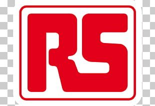

<a name="readme-top"></a>
[![LinkedIn][linkedin-shield]][linkedin-url]

<!-- GETTING STARTED -->
<!-- TABLE OF CONTENTS -->
<details>
  <summary>Table of Contents</summary>
  <ol>
    <li>
      <a href="#about-the-project">About The Project</a>
      <ul>
        <li><a href="#built-with">Built With</a></li>
      </ul>
    </li>
    <li>
      <a href="#getting-started">Getting Started</a>
      <ul>
        <li><a href="#prerequisites">Prerequisites</a></li>
        <li><a href="#installation">Installation</a></li>
        <li><a href="#deploy">Deploy Website</a></li>
      </ul>
    </li>
    <li><a href="#contributing">Contributing</a></li>
    <li><a href="#license">License</a></li>
    <li><a href="#contact">Contact</a></li>
    <li><a href="#acknowledgments">Acknowledgments</a></li>
  </ol>
</details>

## Getting Started

<br />
<div align="center">
  <a href="https://github.com/othneildrew/Best-README-Template">
    
  </a>

  <h3 align="center">Create Your Professional Website
This project is created using HTML, Flex, CSS, SASS, jQuery. You can create your personal professional website free of cost by utilizing my code.
I started making a website few months back. Later, I decided to create a website for my daughter. Then I realize if I make generic website where user can just change JSON object, it would help many. If you have a website which is listed on LinkedIn, it can add more chances of you getting hired.</h3>
  <p align="center">
    Your personal professional website!
    <br />
    <a href="https://github.com/rschreck/html-sass-css"><strong>Explore the docs »</strong></a>
    <br />
    <br />
    <a href="https://rschreck.w3spaces.com/">View Demo1</a>
    .
     <a href="http://reva-resume.s3-website.us-east-2.amazonaws.com/index.html/">View Demo2</a>
    ·
    <a href="https://github.com/rschreck/html-sass-css/issues">Report Bug</a>
    ·
    <a href="https://github.com/rschreck/html-sass-css/issues">Request Feature</a>
  </p>
</div>

<!-- GETTING STARTED -->

## Getting Started

- clone
  ```sh
  git clone https://github.com/rschreck/html-sass-css.git
  ```

or

- download zip from
  `https://github.com/rschreck/html-sass-css`

- install
  ```sh
  npm install
  ```

To get a local copy up and running follow these simple example steps.

### Prerequisites

This is an example of how to list things you need to use the software and how to install them.

- npm
  ```sh
  npm install npm@latest -g
  ```

### Installation

_Below is an example of how you can instruct your audience on installing and setting up your app. This template doesn't rely on any external dependencies or services._

1. Clone the repo
   ```sh
   git clone https://github.com/your_username_/Project-Name.git
   ```
2. Install NPM packages
   ```sh
   npm install
   ```
3. Install NPM packages
   ```sh
   npm start
   ```
4. Update JSON files likes index.json, education.json, experience.json and references.json
5. Add Your resume (pdf) to root level
6. Run Copy
   ```sh
   npm run copy
   ```
7. Make sure all the files are copied to `dist` folder

<p align="right">(<a href="#readme-top">back to top</a>)</p>

### Deploy

_You can choose any popular publishing website. I am adding two examples._

1. Publish on W3C. Go to `https://www.w3schools.com/spaces/index.php`, create a space for you.

   1. Copy all the files from dist to your space.
   2. It will publish a website like `https://rschreck.w3spaces.com/`

2. Publish on aws s3, Example
   1. Create a s3 bucket with unique name.
   2. Follow this youtube `https://www.youtube.com/watch?v=H83xYoC3z4A`

<p align="right">(<a href="#readme-top">back to top</a>)</p>

<!-- CONTRIBUTING -->

## Contributing

Contributions are what make the open source community such an amazing place to learn, inspire, and create. Any contributions you make are **greatly appreciated**.

If you have a suggestion that would make this better, please fork the repo and create a pull request. You can also simply open an issue with the tag "enhancement".
Don't forget to give the project a star! Thanks again!

1. Fork the Project
2. Create your Feature Branch (`git checkout -b feature/AmazingFeature`)
3. Commit your Changes (`git commit -m 'Add some AmazingFeature'`)
4. Push to the Branch (`git push origin feature/AmazingFeature`)
5. Open a Pull Request

<p align="right">(<a href="#readme-top">back to top</a>)</p>

<!-- LICENSE -->

## License

Distributed under the MIT License. See `LICENSE.txt` for more information.

<p align="right">(<a href="#readme-top">back to top</a>)</p>

<!-- CONTACT -->

## Contact

Renuka Schreck - [@linkedIn](https://www.linkedin.com/in/renukaschreck/) - schrer3@gmail.com

Project Link: [https://github.com/rschreck/html-sass-css](https://github.com/rschreck/html-sass-css)

<p align="right">(<a href="#readme-top">back to top</a>)</p>

<!-- ACKNOWLEDGMENTS -->

## Acknowledgments

Use this space to list resources you find helpful and would like to give credit to. I've included a few of my favorites to kick things off!

- [GitHub Emoji Cheat Sheet](https://www.webpagefx.com/tools/emoji-cheat-sheet)
- [Malven's Flexbox Cheatsheet](https://flexbox.malven.co/)
- [Udemy Advanced CSS and SASS](https://www.udemy.com/course/advanced-css-and-sass)

[issues-shield]: https://img.shields.io/github/issues/othneildrew/Best-README-Template.svg?style=for-the-badge
[issues-url]: https:/github.com/othneildrew/Best-README-Template/issues
[license-shield]: https://img.shields.io/github/license/othneildrew/Best-README-Template.svg?style=for-the-badge
[license-url]: https://github.com/rschreck/html-sass-css/blob/main/LICENSE.txt
[linkedin-shield]: https://img.shields.io/badge/-LinkedIn-black.svg?style=for-the-badge&logo=linkedin&colorB=555
[linkedin-url]: https://www.linkedin.com/in/renukaschreck/
[product-screenshot]: images/screenshot.png
[Next.js]: https://img.shields.io/badge/next.js-000000?style=for-the-badge&logo=nextdotjs&logoColor=white
[Next-url]: https://nextjs.org/
[React.js]: https://img.shields.io/badge/React-20232A?style=for-the-badge&logo=react&logoColor=61DAFB
[React-url]: https://reactjs.org/
[Vue.js]: https://img.shields.io/badge/Vue.js-35495E?style=for-the-badge&logo=vuedotjs&logoColor=4FC08D
[Vue-url]: https://vuejs.org/
[Angular.io]: https://img.shields.io/badge/Angular-DD0031?style=for-the-badge&logo=angular&logoColor=white
[Angular-url]: https://angular.io/
[Svelte.dev]: https://img.shields.io/badge/Svelte-4A4A55?style=for-the-badge&logo=svelte&logoColor=FF3E00
[Svelte-url]: https://svelte.dev/
[Laravel.com]: https://img.shields.io/badge/Laravel-FF2D20?style=for-the-badge&logo=laravel&logoColor=white
[Laravel-url]: https://laravel.com
[Bootstrap.com]: https://img.shields.io/badge/Bootstrap-563D7C?style=for-the-badge&logo=bootstrap&logoColor=white
[Bootstrap-url]: https://getbootstrap.com
[JQuery.com]: https://img.shields.io/badge/jQuery-0769AD?style=for-the-badge&logo=jquery&logoColor=white
[JQuery-url]: https://jquery.com
